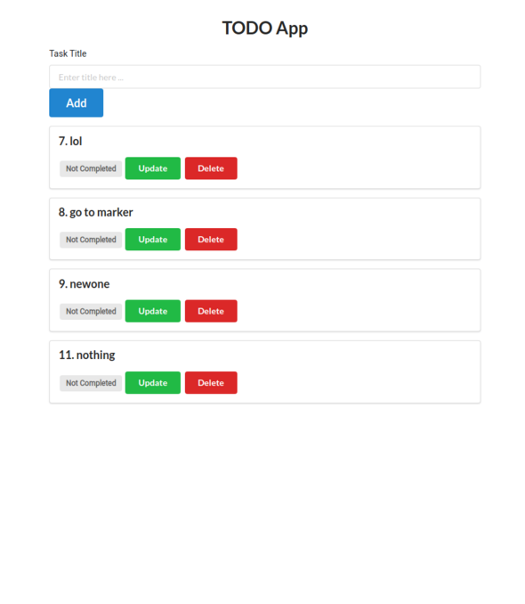

# Flask To-Do App
This is a simple Flask application that allows users to add, update and delete tasks. It uses a SQLite database to store the tasks.

## Installation and Setup
1. Clone the repository to your local machine using git clone https://github.com/tikendraw/flask-todo-app.git
2. Navigate to the project directory ` cd flask-todo-app`
3. Create a virtual environment `python3 -m venv venv`
4. Activate the virtual environment:
        * On Windows, run `venv\Scripts\activate`
        * On Mac or Linux, run `source venv/bin/activate`
5. Install the required packages `pip install -r requirements.txt`
6. Start the server `python todo_app.py`

## Usage
* Open a web browser and go to http://localhost:5000
* Use the form to add tasks
* Click on a "Update" button to mark it as completed
* Click on the "Delete" button to delete a task

## App

## Contributing
1. Fork the repository
2. Create a new branch for your changes `git checkout -b feature/your-feature-name`
3. Make your changes and test them
4. Commit your changes `git commit -am "Add your commit message here`"
5. Push your changes to the branch `git push origin feature/your-feature-name`
6. Create a pull request

## Credits
This project was created by Tikedraw.